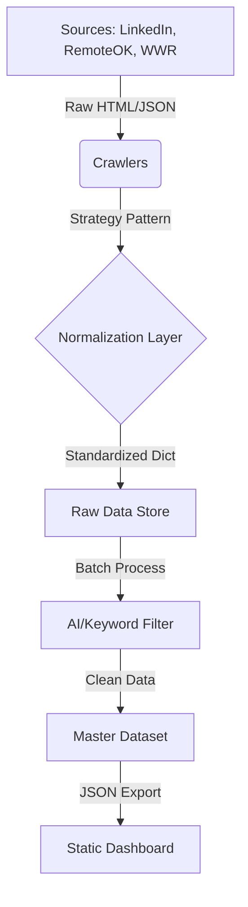

# Engineering Portfolio: Distributed Job Data Aggregation Pipeline

## Project Overview
**AI Jobs** is a scalable ETL (Extract, Transform, Load) pipeline designed to aggregate, normalize, and analyze job market data from multiple disparate sources. 

This project demonstrates advanced data engineering capabilities, including:
- **Resilient Web Scraping**: Handling rate limits, retries, and dynamic content rendering.
- **Data Normalization**: Unifying diverse JSON/HTML schemas into a standardized data model.
- **Automated Filtering**: Using keyword analysis (and optional LLM integration) to classify high-quality opportunities.
- **CI/CD Integration**: Automated workflows for scheduled data ingestion.

## Architecture



## Technical Challenges & Solutions

### 1. Polymorphic Data Sources
**Challenge**: Each job board has a completely different structure (HTML scraping vs. JSON APIs) and schema (different field names for "salary", "location", etc.).
**Solution**: Implemented a **Strategy Pattern** for crawlers. Each crawler inherits from a `BaseCrawler` and implements a `normalize_job()` method, ensuring that the output always adheres to a strict `JobEntry` dataclass schema.

### 2. Rate Limiting & Anti-Bot Measures
**Challenge**: Aggressive scraping leads to IP bans and 429 errors.
**Solution**: 
- Implemented **Exponential Backoff** for retries.
- Randomized `User-Agent` rotation.
- Added jitter (randomized delays) between requests to mimic human behavior.

### 3. Data Quality & Deduplication
**Challenge**: The same job is often posted across multiple boards, leading to noise.
**Solution**: 
- Generated unique content hashes based on (Company + Title + Normalized Location).
- Implemented a deduplication step before merging into the master dataset.

## Tech Stack
- **Language**: Python 3.10+
- **Core Libraries**: `requests`, `BeautifulSoup4`, `pandas`, `pydantic`
- **Testing**: `pytest`
- **Frontend**: HTML5, JavaScript (Static Site)
- **Infrastructure**: GitHub Actions (CI/CD)

## Usage
This repository is designed as a **reference implementation**. 
To run the pipeline locally:

```bash
# Install dependencies
pip install -r requirements.txt

# Run the crawlers
python main.py

# Generate the static site
python generate_static_site.py
```

## Disclaimer
This project is for **educational purposes only**. It is designed to demonstrate data engineering principles. Please respect the Terms of Service of any website you interact with.
